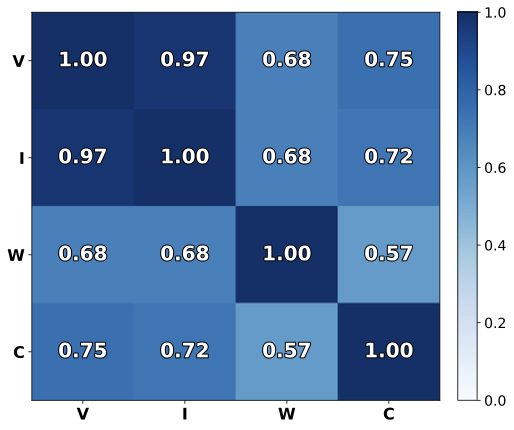

<p align="center">
  
  
  
  
  
</p>
<h1 align="center">
  Flexible Kernels for Protein Property Prediction
</h1>

<p align="center">
  Martin Jankowiak ⋅ Yerdos Ordabayev ⋅ Rudraksh Tuwani ⋅ Henry N. Ward ⋅
  Hunter Nisonoff ⋅ James M. McFarland ⋅ Gevorg Grigoryan
</p>

## Paper Abstract

Despite its importance to applications in protein design, predicting protein properties like binding affinity and thermostability from sparse experimental data remains a significant challenge.
Accordingly, we introduce a class of sequence kernels that exploit evolutionary substitution matrices as well as local linearity and demonstrate that the resulting Gaussian processes provide data-efficient models of protein property landscapes, frequently outperforming alternatives that rely on foundation model embeddings.
Furthermore---by learning what are in effect structure-aware substitution matrices---we show that our kernels can readily incorporate structural information from foundation models. We demonstrate that these structure-conditioned kernels are well suited to multi-task learning across multiple protein property landscapes and can decisively outperform local supervised learning methods.

## Repo contents 

This repo contains a [GPyTorch](https://gpytorch.ai/) implementation of [LOCK GP kernel](lock_gp/lock_kernel.py) as well as a [demo](demo/) on CR6261-H1 antibody fitness data.

## Setup

Python 3.10 or later is required. We recommend [`uv`](https://docs.astral.sh/uv/getting-started/installation/) for easy and reproducible installation.

```bash
git clone git@github.com:generatebio/lock_gp.git
cd lock_gp
uv python install
uv sync
```

This repo was tested with **PyTorch 2.6**.

## Citation

If you use LOCK GP please consider citing our paper:

```bibtex
@inproceedings{jankowiak2026flexible,
  title={Flexible Kernels for Protein Property Prediction},
  author={Jankowiak, Martin and Ordabayev, Yerdos and Tuwani, Rudraksh and Ward, Henry and Nisonoff, Hunter and McFarland, James and Grigoryan, Gevorg},
  booktitle={International conference on machine learning},
  year={2026},
  organization={PMLR}
}
```
